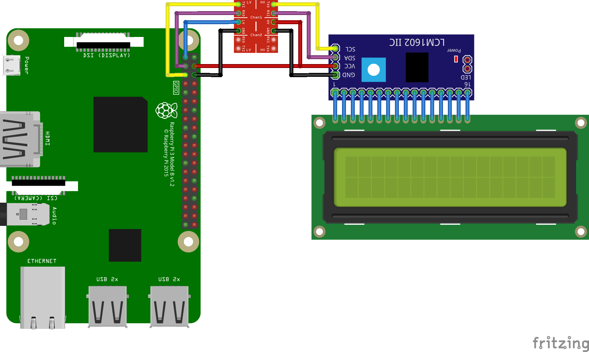

Character display driver for Android Things
===========================================

HD44870 type displays (via LCM1602)



## How to use

1. Create an Android Things project as described [here](https://developer.android.com/things/training/first-device/create-studio-project.html)
2. Add the following to your project's `build.gradle` replace `version` with [latest version](https://bintray.com/davemckelvie/maven/things-drivers/_latestVersion)
```
dependencies {
    compile 'nz.geek.android.things:things-driver-char-display:<version>'
}
```
3. create the lcd object using an `I2cLcdCharacterDisplay.builder()` passing module width and height
4. use the builder to setup the pin mapping between PCF8574 pins and LCD pins
5. call `lcd.connect()` to open and initialise the display
6. write something to the display
```java

private CharacterDisplay lcd;

@Override
protected void onCreate(Bundle savedInstanceState) {
  super.onCreate(savedInstanceState);

  // create a display builder with the LCD module width and height
  I2cLcdCharacterDisplay.Builder builder = I2cLcdCharacterDisplay.builder(20, 4);

  // set port pin to LCD pin mapping, and PCF8574(A) address
  builder.rs(0).rw(1).e(2).bl(3).data(4, 5, 6, 7).address(6);

  // build and use the display
  CharacterDisplay lcd = builder.build();
  lcd.connect();

  // write message to the display, the first argument
  // is the LCD line (row) number
  lcd.print(1, "Hello World!");
}

@Override
public void onDestroy() {
  super.onDestroy();

  // disconnect from the display to free resources
  lcd.disconnect();
}
```

